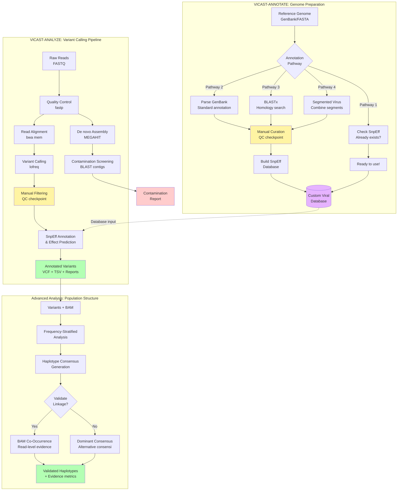

# VICAST User Guides

Complete documentation for all VICAST features and workflows.

---

## 🔄 VICAST Workflow Overview



**Legend:**
- 🔵 **Blue boxes** = Input data
- 🟠 **Orange boxes** = Processing steps
- 🟡 **Yellow diamonds** = Manual QC checkpoints
- 🟣 **Purple** = Database
- 🟢 **Green** = Final outputs
- 🔴 **Red** = Quality control reports

---

## 📚 Quick Navigation

### Getting Started
- **[Getting Started Guide](GETTING_STARTED.md)** - Installation, setup, and first analysis

### Core Workflows
- **[VICAST-Annotate Guide](VICAST_ANNOTATE_GUIDE.md)** - Annotate viral genomes for SnpEff
- **[VICAST-Analyze Guide](VICAST_ANALYZE_GUIDE.md)** - Complete variant calling pipeline
- **[Contamination Screening Guide](CONTAMINATION_SCREENING_GUIDE.md)** - De novo assembly + BLAST pipeline

### Advanced Features
- **[Haplotype Consensus Guide](HAPLOTYPE_CONSENSUS_GUIDE.md)** - Generate frequency-stratified consensus genomes
- **[BAM Co-Occurrence Guide](BAM_COOCCURRENCE_GUIDE.md)** - Read-level validation of variant linkage

### Reference
- **[Parameter Reference](PARAMETER_REFERENCE.md)** - Complete parameter documentation
- **[Troubleshooting Guide](TROUBLESHOOTING.md)** - Common issues and solutions

---

## By Use Case

### 🧬 New to VICAST?
1. [Getting Started Guide](GETTING_STARTED.md)
2. [VICAST-Analyze Guide](VICAST_ANALYZE_GUIDE.md)
3. [Contamination Screening Guide](CONTAMINATION_SCREENING_GUIDE.md)

### 📊 Passage Studies
1. [VICAST-Analyze Guide](VICAST_ANALYZE_GUIDE.md)
2. [Haplotype Consensus Guide](HAPLOTYPE_CONSENSUS_GUIDE.md)
3. [BAM Co-Occurrence Guide](BAM_COOCCURRENCE_GUIDE.md) - for validation

### 🆕 Adding New Virus
1. [VICAST-Annotate Guide](VICAST_ANNOTATE_GUIDE.md)
2. [VICAST-Analyze Guide](VICAST_ANALYZE_GUIDE.md)

### 🔬 Publication-Quality Analysis
1. [Contamination Screening Guide](CONTAMINATION_SCREENING_GUIDE.md) - critical for publications
2. [Haplotype Consensus Guide](HAPLOTYPE_CONSENSUS_GUIDE.md) - population structure
3. [BAM Co-Occurrence Guide](BAM_COOCCURRENCE_GUIDE.md) - validate claims

---

## Guide Descriptions

### Core Workflows

#### Getting Started Guide
Complete installation and setup instructions for VICAST on different systems (local, HPC, Docker). Includes quickstart example and verification steps.

#### VICAST-Annotate Guide (VICAST-Annotate)
How to prepare viral genomes for variant annotation:
- Download genomes from NCBI
- Parse GFF/GenBank files
- Build SnpEff databases
- Validate annotations
- Troubleshoot common issues

#### VICAST-Analyze Guide (VICAST-Analyze)
Complete variant calling pipeline from FASTQ to annotated VCF:
- Quality control (fastp)
- Read alignment (bwa)
- Variant calling (lofreq)
- Variant annotation (SnpEff)
- Filtering and reporting

#### Contamination Screening Guide
De novo assembly and BLAST-based contamination detection:
- When to use contamination screening
- De novo assembly with megahit
- BLAST against contamination databases
- Interpreting results
- Reporting for publications

### Advanced Features

#### Haplotype Consensus Guide
Generate frequency-stratified consensus genomes:
- Understanding variant frequencies
- Parameter selection by virus type
- Biological interpretation
- Publication language
- Limitations and caveats

#### BAM Co-Occurrence Guide
Validate variant co-occurrence with read-level evidence:
- When direct evidence is needed
- Running co-occurrence analysis
- Interpreting results
- Integration with haplotype consensus
- Strengthening publication claims

---

## Quick Reference Tables

### Command Cheat Sheet

| Task | Command | Guide |
|------|---------|-------|
| Install VICAST | `pip install -e .` | [Getting Started](GETTING_STARTED.md) |
| Annotate genome | `python step1_parse_viral_genome.py NC_001477` | [Annotation](VICAST_ANNOTATE_GUIDE.md) |
| Run variant calling | `bash run_pipeline.sh R1.fq.gz R2.fq.gz NC_001477` | [Variant Calling](VICAST_ANALYZE_GUIDE.md) |
| Screen contamination | `bash viral_diagnostic.sh reads.fq.gz` | [Contamination](CONTAMINATION_SCREENING_GUIDE.md) |
| Generate consensus | `python generate_realistic_haplotype_consensus.py` | [Haplotype](HAPLOTYPE_CONSENSUS_GUIDE.md) |
| Check co-occurrence | `python check_read_cooccurrence.py` | [BAM](BAM_COOCCURRENCE_GUIDE.md) |

### Typical Workflows

**Complete Analysis Pipeline:**
```bash
# 1. Annotate genome (once per virus)
python vicast-annotate/step1_parse_viral_genome.py NC_001477

# 2. Run variant calling
cd vicast-analyze
bash run_pipeline_htcf_consolidated.sh R1.fastq.gz R2.fastq.gz NC_001477 4

# 3. Screen for contamination
bash viral_diagnostic.sh sample_R1.fastq.gz sample_R2.fastq.gz

# 4. Generate consensus genomes
python generate_realistic_haplotype_consensus.py \
    --vcf sample_variants.vcf \
    --reference NC_001477.fasta \
    --accession NC_001477

# 5. Validate with BAM (optional)
python check_read_cooccurrence.py \
    --bam sample_aligned.bam \
    --vcf sample_variants.vcf \
    --output cooccurrence.tsv
```

**Quick Passage Study:**
```bash
# For each passage, run variant calling
for passage in P0 P5 P10; do
    bash run_pipeline.sh ${passage}_R1.fq.gz ${passage}_R2.fq.gz NC_001477
done

# Generate consensus for each
for passage in P0 P5 P10; do
    python generate_realistic_haplotype_consensus.py \
        --vcf ${passage}_variants.vcf \
        --reference NC_001477.fasta \
        --accession NC_001477 \
        --output-prefix ${passage}
done

# Compare frequency changes across passages
```

---

## Support & Troubleshooting

- **Common Issues:** See [Troubleshooting Guide](TROUBLESHOOTING.md)
- **Bug Reports:** https://github.com/mihinduk/VICAST/issues
- **Questions:** Check existing issues or create new one

---

## Contributing to Documentation

Found an error or have a suggestion? Please:
1. Open an issue on GitHub
2. Submit a pull request with corrections
3. Share your use case for new guide ideas

---

**Last Updated:** 2026-02-05
**VICAST Version:** 2.2.0
